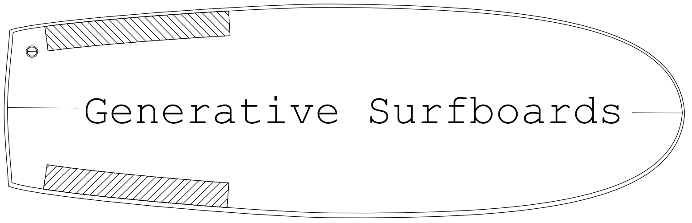
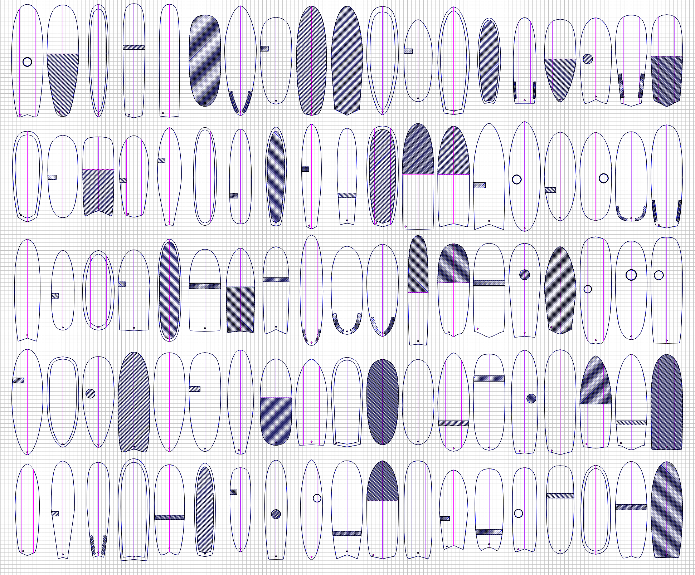

<p style="text-align:center">
  
</p>
Procedurally generated, vector based surfboards.

## About
During one of many discussions on the merrits and compromises of various surfboard designs I decided it would be fun to procedurally generate some with the tropes and visual stylings of what was popular at the time. I aimed for the end result to be thought provoking but also visually appealing appealing enough to hang on the wall.

<p style="text-align:center">
  
</p>

## Setup
```
git clone git@github.com:davidhampgonsalves/generative-surfboards.git
cd generative-surfboards
yarn install
node index.js
// output surfboard svg will be in the out dir
```

### Run Multiple Times (zsh)
```
repeat 50 {node index.js}
```
